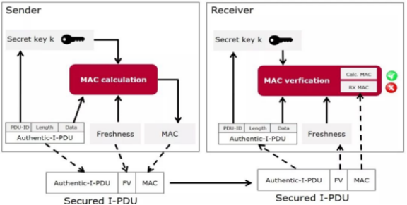
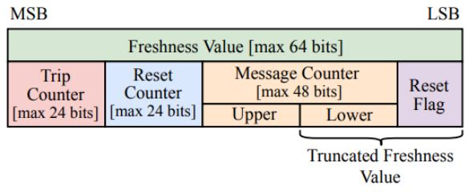
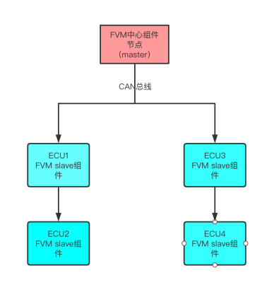
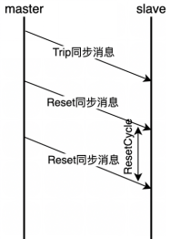
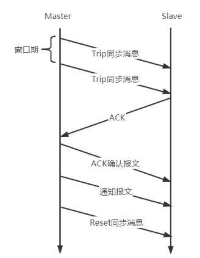

# SecOC-lite

## 编译
进入项目文件夹
```
cd SecOC-lite
```

运行脚本
```
.\build.bat
```

## 运行

进入`build`文件夹
```
cd build/
```

用`visual studio`打开.sln文件

## 项目说明

- 本项目是一个在车载系统AUTOSAR中SecOC安全框架中的新鲜值管理机制的实现

- SecOC的作用：SecOC旨在为PDU (Protocol Data Unit)的关键数据提供有效可行的认证机制。该认证机制能够与当前的 AUTOSAR通信系统进行无缝集成，占用很少的系统资源，且可以作为一个附属功能存在

  

- 新鲜值作用：当上图中Sender和Receiver两个ECU通信时，Sender将PDU发送到CAN总线上，SecOC通过在总线消息中附加新鲜度值FV来验证消息是一条新鲜的消息，从而有效预防重放攻击对车辆带来的安全威胁

- 新鲜值的结构：

  

### 管理机制的实现

- 架构

  

- 每种消息有单独的canid作为标识

- 目标：管理每个canid的新鲜度值目前的状态，具体就是维护Tirp Counter、Reset Counter的值，并将这些值同步给相关的ECU。而每个ECU内部，也需要增加相关的配合机制，根据FVM的机制，完成ECU本地计数器的同步，为消息通信奠定新鲜度值的准备

#### Master：

- 此节点为全局FV管理的中心节点，负责每个canid的Trip Counter和Reset Counter的管理和同步

- 同步流程如下：

  

- **主要功能**如下：

  - 维护Trip Counter计数器的值（每次启动+1）
  - 发送Trip Counter计数器值的同步消息
  - 统计各ECU成功同步Trip Counter的响应ACK消息
  - 返回接收的的ack报文对应的确认报文
  - 确定全局的Trip Counter都同步成功后，发送通知报文车辆处于准备就绪状态
  - 若有未同步成功的Trip Counter，重新执行1-5
  - 维护每个canid的Reset Cycle重置周期
  - 根据canid的重置周期判断某个canid是否达到了Reset Counter计数器+1的条件
  - 对Reset Counter进行+1
  - 广播ResetCounter的同步消息

- **测试**如下功能（单元测试）：

  - 测试每次启动Trip Counter + 1
  - 测试Trip同步消息值的正确生成
  - 测试Reset同步消息值的正确生成

#### Slave

- 部署在每个需要参与安全通信的ECU中，配合Master工作

- 收到Trip同步消息需要回复ACK

  

- **主要功能**如下：

  - 接收Trip Counter同步消息，同步本地Trip Counter值
  - 发送Trip Counter同步成功ACK消息
  - 接收Master发送的ack确认报文，修改标志位，再次受到Trip Counter同步消息不做处理
  - 接收Reset Counter 同步消息，同步本地Reset Counter值
  - 发送消息的时候，生成最新的FV值
  - 接收消息的时候，根据收到的FV（部分）还原FV值

- 测试如下功能（单元测试）：

  - TODO


### 标准化对外接口

- 根据AUTOSAR规范对实现的所有API进行标准化